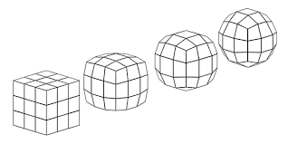

The shapes of a cube, a sphere, and a torus are all different but of these three the torus is the *most* different in a very important way.
In particular, we can "morph" a cube into a sphere by smoothing the edges and pushing in the corners.

However, no amount of squeezing, pulling, or massaging will allow us to transform a torus into a sphere or a cube, at least not without cutting and regluing parts of our shape.  The torus has some property that makes its shape fundamentally different from the other two.  Topology studies properties of different shapes, called **topological spaces**, which cannot be changed by squeezing and pulling.  At its heart, it tries to decide which topological spaces are topologically equivalent, called **homeomorphic**, or distinct.
Often this comes down to showing that two different topological spaces have different topological properties.

**Question:** Which of the following properties are *topological properties* of a surface (such as a sphere, cube, or torus), meaning that they don't change even if we change the shape by squeezing, pulling and massaging it?
* (A) The surface area
* (B) The number of corners
* (C) The number of holes

  

  Reveal answer for (A).
  

  The area changes as we shrink or expand our shape by squeezing or stretching it, so it is not a topological property.

  

  Reveal answer for (B).
  

  Corners can be smoothed away, just like when we make a cube into a sphere.  Therefore it is not a topological property.

  

  Reveal answer for (C).
  

  Setting aside the important task of rigorously defining a "hole", intuitively we can understand that by squeezing or stretching a surface we cannot change the number of holes.  Therefore the number of holes *is* a topological property.

 

In this class, we will be mostly concerned with *point set topology* (also known as *general topology*), which focuses on the *foundational* properties of topology:  open sets; continuity; connectedness; compactness; and dimension, that more advanced topological subjects (such as algebraic topology and low-dimensional topology) are built upon.
By its nature, point set topology is motivated by, and thus has strong connections with, fundamental ideas in real analysis.

For a very concrete example, consider the following.  A point at the center of the letter *X* is somehow very different from the point at the center *Y*.  For this reason, the letters *X* and *Y* are not homeomorphic.  Point set topology works to understand this by understanding what each letter looks like "close to", or in a **neighborhood** of the point.  In this way a notion of what points are close together, or what constitutes a neighborhood, is the key idea in the definition of a **topological space**.  Once we decide what the neighborhoods (also called **open sets**) are, we can understand what it means for functions between topological spaces to be **continuous**.  

