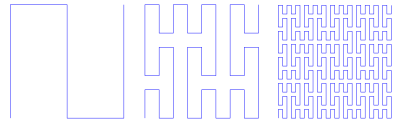

**Additional reading:** Simmons 6.31

Intuitively, a topological space $$X$$ is connected if isn't made up of two separate parts.  There are a couple of intuitive ways to think about this: 
* $$X$$ is *path connected* if there is a continuous path betweeen any two points;
* $$X$$ is *connected* if it cannot be partitioned into multiple non-empty open sets.

These two notions of connectedness are related but are not equivalent.
In this part, we will focus in the second version of connectedness.

### Connectedness

**Definition:**  A topological space $$X$$ is **disconnected** if there exist non-empty, disjoint open subsets $$U,V\subseteq X$$ satisfying $$U\cup V = X$$.  The space is **connected** if it is not disconnected.  More generally, a subset $$Y\subseteq X$$ is connected (or disconnected) if it is connected (or disconnected) as a topological space with the relative topology.

**Example:** The set of rational numbers is disconnected.

**Example:** The Cantor set is disconnected.

**Example:** Let $$X$$ be any topological space.  Then a singleton set is connected.

**Example:** The real line is connected.

Topologically, connectedness is preserved under closures.

**Theorem:** If $$A\subseteq X$$ is connected, then so is $$\overline A$$.

**Proof:** Suppose that $$A$$ is connected.  If $$\overline A$$ is disconnected, the we can write $$\overline A$$ as the disjoint union of two non-empty open subsets $$U$$ and $$V$$.  It follows that $$A$$ is the disjoint union of $$A\cap U$$ and $$A\cap V$$, both of which are open in the relative topology, so either $$A\cap U=\varnothing$$ or $$A\cap V=\varnothing$$.  Without loss of generality $$A\cap U=\varnothing$$.  Then $$A$$ is contained in the closed set $$U'$$, so the closure of $$\overline{A}$$ of $$A$$ is also contained in $$U'$$.  Since $$U$$ and $$V$$ partition $$\overline{A}$$, this is a contradiction.

### Connected sets of real numbers

**Theorem:** A subset of $$\mathbb R$$ is connected if and only if it is an interval.

**Proof:**
Suppose that $$A\subseteq R$$ is connected and let $$a,b\in A$$ with $$a < b$$.
Suppose that $$c\in (a,b)$$ is not in $$A$$.
Then $$A$$ can be expressed as the union of the nonempty, disjoint sets $$A\cap (-\infty,c)$$ and $$A\cap (c,\infty)$$ both of which are open in the relative topology.
Consequently $$(a,b)\subseteq A$$.
It follows that $$A$$ has to be an interval.

Without loss of generality, we may assume $$x\in U$$ and $$y\in V$$.
It is easy to see that $$z=\inf [x,y]\cap V$$, and since $$V$$ is closed $$z\in V$$.
However, this contradicts $$U\cap V = \varnothing$$.
Thus $$[x,y]$$ is connected.

It remains to show that if $$A$$ is an interval, then it is connected.
Now suppose that $$A$$ is an interval which is disconnected.
Then we can write $$A = (U\cap A)\cup (V\cap A)$$ for some disjoint, nonempty open subsets $$U$$ and $$V$$ of $$\mathbb{R}$$.
Take $$x\in U$$ and $$y\in V$$ and without loss of generality assume $$x < y$$.
Then since $$A$$ is an interval $$[x,y]\subseteq A$$.
It follows that $$[x,y]$$ is the disjoint union of $$U_1 = [x,y]\cap U$$ and $$V_1 = [x,y]\cap V$$, so $$[x,y]$$ is disconnected.
Note that $$U_1 = [x,y]\cap V'$$ and therefore $$U_1$$ is closed.  Likewise $$V_1$$ is closed.
Let $$z=\sup U$$.  Since $$U$$ is closed, $$z\in U$$.
However, $$U$$ is also open so there exists $$r>0$$ such that $$B_r(z)\cap [x,y]$$ is contained in $$U$$.
Since $$z\neq y$$, we may take $$r$$ to be less than $$y-z$$ and less than $$z-x$$.
Therefore $$B_r(z) = (z-r,z+r)\subseteq U$$.
This implies, for example, that $$z + r/2$$ is contained in $$U$$, contradicting the fact that $$z$$ is the supremum.
Therefore $$A$$ is connected.
This completes the proof.

One of the most useful parts of connectedness is that connectedness is preserved under continuous maps.
This leads to many important results, such as the Intermediate Value Theorem from calculus!

**Theorem:** Let $$f: X\rightarrow Y$$ be a continuous function between topological spaces.  If $$X$$ is connected, then $$f(X)$$ is connected.

**Proof:**
It suffices to prove the contrapositive: that if $$f(X)$$ is disconnected, then $$X$$ is disconnected.
To see this, suppose that $$f(X)$$ is disconnected.  Then there exist nonempty, disjoint, open subsets $$U$$ and $$V$$ of $$f(X)$$ whose union is $$f(X)$$.
It follows that $$f^{-1}(U)$$ and $$f^{-1}(V)$$ are nonempty, disjoint, open subsets of $$X$$ whose union is $$X$$.
Hence $$X$$ is disconnected.

**Corollary (Intermediate Value Theorem):** Let $$f: [a,b]\rightarrow\mathbb R$$ be a continuous function.  Then for any $$y_0$$ between $$f(a)$$ and $$f(b)$$ there exists $$x_0\in [a,b]$$ with $$f(x_0) = y_0$$.

**Proof:** The interval $$[a,b]$$ is connected, so $$f([a,b])$$ is connected.  Therefore it is an interval, meaning it achieves all values between $$f(a)$$ and $$f(b)$$.

As another application, we can prove that the interval $$(-1,1)$$ and the unit circle

$$S^1 = \{(x,y)\in \mathbb R^2: x^2 + y^2 = 1\}$$

are not homeomorphic.  To see this, suppose that $$f: S^1\rightarrow (-1,1)$$ is a homeomorphism.   Then there exists a unique point $$(x_0,y_0)\in S^1$$ with $$f(x_0,y_0) = 0$$.  Then the subspace $$X = S^1\diff \{(x_0,y_0)\}$$ of $$S^1$$ is connected and $$f$$ restricts to a homeomorphism $$f: S^1\rightarrow (-1,0)\cup (0,1)$$.
However, this latter set is not connected, so this is impossible!

## Euclidean space

So far, we have shown that $$\mathbb R$$ is connected, and more generally that any interval in $$\mathbb R$$ is connected.
However, what about higher dimensions?
To address this, we consider a functional characterization of connectedness.

**Theorem:** A topological space $$X$$ is disconnected if and only if there exists a non-constant, continuous function $$f: X\rightarrow \{0,1\}$$, where here the latter space has the discrete topology.

**Proof:** Exercise.

Leveraging this, we can prove that the product of any collection of connected spaces is connected.

**Theorem:** Let $$\{X_i: i\in I\}$$ be a collection of connected topological spaces.  Then the product $$\prod_{i\in I} X_i$$ is connected.

**Proof:**  Let $$X = \prod_{i\in I} X_i$$ and suppose that there exists a continuous function $$f: X\rightarrow \{0,1\}$$.
Fix $$(a_i: i\in I)\in X$$.
For any $$j\in I$$, let $$\iota_j: X_j\rightarrow X$$ be the function which sends $$x$$ to the element whose $$i$$'th entry is $$a_i$$ for $$i\neq j$$ and whose $$j$$'th entry is $$x$$.
Then $$f_j = f\circ \iota_j: X_j\rightarrow \{0,1\}$$ is continuous and therefore is constant.
It follows that if $$(b_i: i\in I)$$ differs from $$(a_i: i\in I)$$ at finitely many vertices, then $$f((a_i)) = f((b_i))$$.
The set of all such points is dense in $$X$$, so $$f$$ itself is constant.
This shows $$X$$ is connected.

**Corollary**:  $$\mathbb R^n$$ is connected.

**Proof:** We know that $$\mathbb R^n$$ is homeomorphic to the product of $$n$$ copies of $$\mathbb{R}$$, so it follows from the previous theorem.

### Are different Euclidean spaces homeomorphic?

As we already know, both $$\mathbb R$$ and $$\mathbb R^2$$ have the same cardinality.
Likewise, the closed interval $$[0,1]$$ and the closed unit square $$[0,1]^2 = [0,1]\times [0,1]$$ have the same cardinality, so there exists a bijection

$$f: [0,1]\rightarrow [0,1]^2.$$

Thus one question we could ask is whether $$[0,1]$$ and $$[0,1]^2$$ are *homeomorphic*, ie. whether there is a continuous, bijective, open map from one to the other.
At first blush, this seems preposterous!  The continuous image of an interval $$[0,1]$$ is a continuous **curve**, so can there really be such a curve which passes through each point in two dimensions?  Surprisingly, the answer is yes!
One example is the Peano Curve, discovered in 1890.

Thus the question of whether these two spaces are homeomorphic is far more delicate than it originally appears.

**Question:** Can you prove that $$[0,1]$$ and $$[0,1]^2$$ are not homeomorphic?

  
Solution.

  Suppose you have a homeomorphism.  Then remove a point and show that this maps a connected space homeomorphically to a disconnected space.

